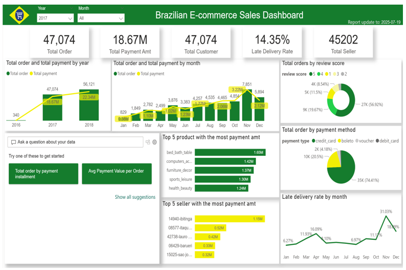

# End-to-End Sales ETL Pipeline
> Apache Airflow × Apache Hop × PostgreSQL × Power BI

This project showcases a complete **data pipeline for sales analytics**, integrating **Apache Airflow**, **Apache Hop**, **PostgreSQL**, and **Power BI**.

---

## Data Flow Overview

The pipeline automates the process from raw sales CSV files to business dashboards.

  

---

##  Key Features

✅ Automated ETL process using Apache Hop  
✅ Workflow orchestration with Apache Airflow  
✅ Data warehouse built on PostgreSQL  
✅ Business visualization with Power BI  
✅ Containerized setup via Docker Compose  

---
## 🧭 Airflow Orchestration

The ETL pipeline is managed and scheduled using **Apache Airflow**.  
Each DAG automatically triggers the Apache Hop workflow daily to extract, transform, and load sales data.

  

## 📊 Dashboard Preview

Here’s the Power BI dashboard built from the ETL pipeline:

  

---

## 🧱 Tech Stack

| Tool | Purpose |
|------|----------|
| **Apache Hop** | Data extraction, transformation & loading (ETL) |
| **Apache Airflow** | Workflow orchestration |
| **PostgreSQL** | Centralized data storage |
| **Power BI** | Data visualization |
| **Docker Compose** | Container orchestration |

---

## 👩‍💻 Author

**Doan Thi Hai Yen**  

---

